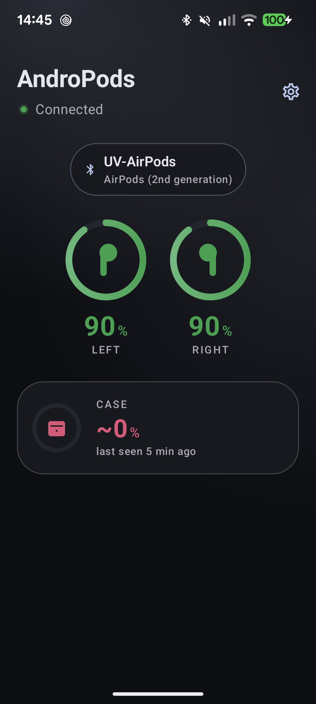
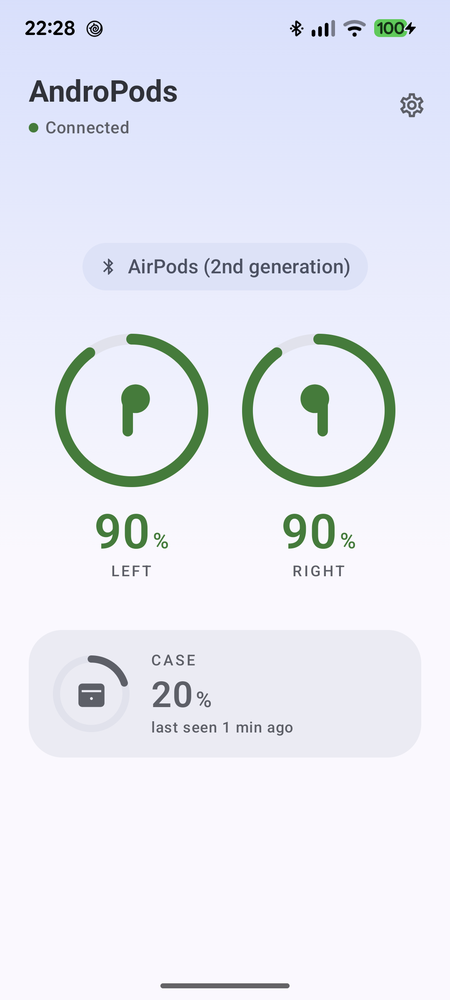
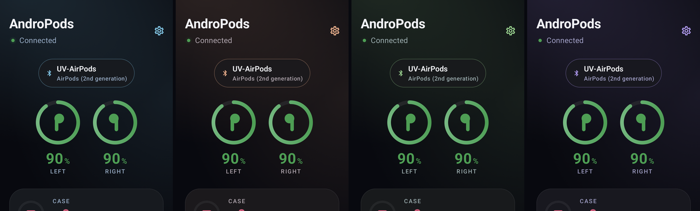

<p align="center">
  
  &nbsp;&nbsp;
  
</p>

<h1 align="center">AndroPods</h1>

<p align="center">
  AirPods battery on Android — left, right and case, live, with a card that slides in when they connect.
</p>

<p align="center">
  <a href="https://github.com/Ovalvoi/AndroPods/actions/workflows/android.yml"></a>
  <a href="https://github.com/Ovalvoi/AndroPods/releases/latest"></a>
  
  
</p>

Android never shows you the battery of your AirPods — the phone only sees them as a generic headset. AndroPods listens to the Bluetooth LE beacon the AirPods broadcast anyway, decodes it, and shows the numbers. No account, no internet permission, no ads.

## Features

- **Live battery readout** for the left bud, the right bud and the case, in colour: green, orange at 40% and below, red at 20% and below.
- **Charging indicator** on whichever pod or case is charging.
- **Connect popup** — a themed card slides in from the edge of the screen when your AirPods connect, over whatever app you are in, showing all three levels. Choose top or bottom; auto-dismisses after 3 / 8 / 15 s, or stays until swiped.
- **Case-opened popup** — the same brief summary when you open the lid.
- **Battery rings in the notification** — the ongoing status entry draws a real gauge per component, colour-coded, on a single line.
- **Remembers the case.** With both buds in your ears the case cannot report its level (its radio is in the buds — an iPhone shows nothing either). AndroPods shows the last reading it saw and how old it is.
- **Resume music when connected** (optional) — sends Play to the last app that was playing, the way an iPhone does.
- **Your name for them.** If you renamed your AirPods in Android's Bluetooth settings, that name is what the app, the popup and the notification show — not the generic "AirPods" every pair broadcasts.
- **Five colourways** — Default (neutral), Ocean, Sunset, Forest, Grape — each in light and dark, with a system / light / dark override. One design, five palettes: only the accent hue changes.
- **Battery-friendly.** The scanner only runs while your bonded AirPods are actually connected over Bluetooth, and it uses the radio's batched delivery so the CPU sleeps between readings.
- **No location permission.** Bluetooth scanning is declared `neverForLocation`, so Android does not ask for it.

<p align="center">
  
</p>

## Requirements

| | |
|---|---|
| Phone | Android **12 or newer** (API 31+) with Bluetooth LE. Developed and tested on a Pixel 7. |
| Earbuds | **AirPods (2nd generation, 2019)** — model A2031 / A2032, case A1602 / A1938. |
| Other AirPods | Not supported yet. Newer models moved battery into an encrypted part of the beacon; see [Compatibility](#compatibility). |

## Install

### Option 1 — download the APK

1. Open the [latest release](https://github.com/Ovalvoi/AndroPods/releases/latest) on your phone and download `AndroPods-<version>.apk`.
2. Tap the downloaded file. If Android asks, allow your browser or Files app to *install unknown apps* — this is normal for any app outside the Play Store.
3. Open AndroPods once and grant the two permissions it asks for (see [Permissions](#permissions)).

To update later, install the new APK over the old one; your settings are kept.

### Option 2 — build it yourself

You need [Android Studio](https://developer.android.com/studio) Narwhal 3 Feature Drop (2025.1.3) or newer — the project uses Android Gradle Plugin 8.13 — **or** a JDK 17+ plus the Android SDK with API 36.

**Android Studio:** *File ▸ Open* the cloned folder, wait for Gradle sync, then *Run ▸ Run 'app'* with your phone connected.

**Command line:**

```bash
git clone https://github.com/Ovalvoi/AndroPods.git
cd AndroPods
export ANDROID_HOME=/path/to/Android/Sdk    # or create local.properties with sdk.dir=...
./gradlew assembleDebug                      # Windows: gradlew.bat assembleDebug
adb install -r app/build/outputs/apk/debug/app-debug.apk
```

The first build downloads Gradle 9.2 and the Android dependencies, so it takes a few minutes.

## First run

1. **Pair the AirPods in Android's Bluetooth settings** as you normally would. AndroPods does not pair or connect anything itself; it only reads.
2. **Open AndroPods once** so it can ask for permissions. From then on it starts by itself whenever the AirPods connect and stops when they disconnect — you never need to open it again unless you want to.
3. Put the buds in and the readout appears within a few seconds. The first reading can take up to ~5 s; that is the radio's batching window, not a hang.

### Permissions

| Prompt | Why |
|---|---|
| **Nearby devices** | Reading the Bluetooth LE beacon and noticing when your AirPods connect. Declared `neverForLocation`, so no location permission is involved. |
| **Notifications** | The status notification and the case-opened popup. Deny it and the app still works; you just lose the notifications. |

There is one more, granted from Settings rather than a prompt: **Display over other apps**, which the connect popup needs to draw over whatever you are using. Deny it and the rest of the app is unaffected.

AndroPods has no internet permission and never sends anything anywhere.

## Settings

Tap the gear in the top-right corner.

- **Appearance** — pick one of the five colourways, and force light or dark mode.
- **Popups** — whether the connect popup appears and at which edge, whether it dismisses itself, and after how long. Granting *Display over other apps* is what lets it draw over other apps; without it the popup is skipped and everything else still works.
- **Audio** — resume music when the AirPods connect.
- **Gestures** — an explanation of why double-tap cannot be configured from Android: the action is stored in the pods and only an iPhone can change it. The default (Siri) opens your Android assistant; Play/Pause, Next and Previous work as expected.

## Troubleshooting

**"AirPods not connected" although they are in my ears.** Check that they show as connected in Android's Bluetooth settings, then open AndroPods once — on a cold start (first install, or after a reboot) the app has to see them connect, or be opened while they already are.

**"Looking for your AirPods…" never turns into numbers.** The beacon is not getting through. Toggle Bluetooth off and on. If it stays stuck, a paired-but-absent Bluetooth LE accessory (a selfie shutter, a tracker, a smart tag) can silently starve all BLE scanning on the phone — forget any such device you no longer use. Details in the [technical notes](docs/TECHNICAL.md#on-device-status-pixel-7-android-17--api-37).

**The connect popup never appears.** It needs *Display over other apps*, which is not a normal permission prompt — grant it from *Settings ▸ Popups ▸ Show on connect ▸ Grant*, or from *Android Settings ▸ Apps ▸ AndroPods ▸ Display over other apps*. The popup fires on the first battery reading after connecting, which takes a second or two.

**It shows "AirPods" instead of the name I gave them.** Rename the pods in *Android Settings ▸ Bluetooth ▸ AirPods ▸ ✏️*. A name set on an iPhone lives in the pods, not in Android, so Android does not see it.

**Case shows "last seen … ago".** Expected whenever both buds are out of the case: the case has no radio of its own, so its level is only reported while a bud sits in it. Put one in and the live level returns.

**Other AirPods models show nothing.** Only the 2nd generation is decoded today; see [Compatibility](#compatibility).

**The notification disappeared after a while.** Some phones kill background services aggressively. Exempt AndroPods from battery optimisation (*Settings ▸ Apps ▸ AndroPods ▸ Battery ▸ Unrestricted*).

## How it works

AirPods continuously broadcast an unencrypted Bluetooth LE advertisement — Apple's *proximity pairing* beacon — that carries battery and lid state. AndroPods runs a filtered BLE scan for that beacon **only while your bonded AirPods are connected over classic Bluetooth**, decodes it, and shows the result. Because every pair of Gen 2 AirPods looks alike on the air, that classic connection is what ties the readout to *your* pods; among nearby candidates the strongest signal wins, with hysteresis so a passing stranger cannot hijack it.

The full write-up — payload layout, the two decoding traps, the on-device measurements that shaped the scanner settings, what was tried and rejected, and the remaining checks — is in **[docs/TECHNICAL.md](docs/TECHNICAL.md)**.

## Compatibility

Targets AirPods (2nd generation) specifically. Newer models moved the battery fields into the AES-encrypted tail of the beacon, and AirPods 4 on recent firmware emit no `0x07` frames at all in reproducible states, so supporting them needs a second parse path and a way to obtain the key. Contributions with captured frames from other models are very welcome.

## Development

```bash
./gradlew testDebugUnitTest    # 59 JVM unit tests: parser, tracker, settings, colour bands
./gradlew lintDebug            # Android lint
./gradlew assembleDebug        # debug APK
./gradlew assembleRelease      # minified release APK (unsigned unless signing env vars are set)
```

Kotlin, Jetpack Compose, Material 3. No third-party runtime dependencies beyond AndroidX.

```
app/src/main/java/com/ovalvoi/andropods/
├── ble/        PodsScanner (BLE scan), ProximityPayload (beacon parser), PodsTracker (which pods are ours)
├── data/       PodsRepository (state + device name), AppSettings + SettingsStore, CaseMemory, Appearance
├── service/    PodsService (foreground scan), BondReceiver (start/stop on connect), notifications, BatteryGlyph, MediaResumer
└── ui/         PodsScreen, SettingsScreen, components/ (BatteryRing, cards), overlay/ (connect popup),
                theme/ (palettes, battery colours, dimens)
```

On Windows, `./gradlew clean` can fail with a file lock while the daemon holds lint jars open; run `./gradlew --stop` first.

The instrumented tests under `app/src/androidTest` are radio diagnostics rather than a test suite; how to run them is in the [technical notes](docs/TECHNICAL.md#on-device-status-pixel-7-android-17--api-37).

### Releases and signing

[CI](.github/workflows/android.yml) runs the tests, lint and both APK builds on every push, and publishes a GitHub Release with the APKs when you push a tag:

```bash
git tag v0.3.0 && git push origin v0.3.0
```

For a **signed** release APK (installable over previous versions), add four repository secrets — `ANDROPODS_KEYSTORE_BASE64` (the `.jks` file base64-encoded), `ANDROPODS_KEYSTORE_PASSWORD`, `ANDROPODS_KEY_ALIAS`, `ANDROPODS_KEY_PASSWORD`. Without them CI still produces an unsigned release APK plus an installable debug APK. Locally, export the same names (`ANDROPODS_KEYSTORE_FILE` pointing at the `.jks` instead of the base64 one) before `./gradlew assembleRelease`.

## Credits

The beacon layout comes from [Celosia & Cunche, PETS 2020](https://petsymposium.org/popets/2020/popets-2020-0003.pdf), cross-checked against [librepods](https://github.com/librepods-org/librepods), [LightPods](https://github.com/gi-os/LightPods), [airpods-on-android](https://github.com/ioscastaway/airpods-on-android) and [AirStatus](https://github.com/delphiki/AirStatus). AirPods is a trademark of Apple Inc.; this project is not affiliated with Apple.

## License

[MIT](LICENSE).
